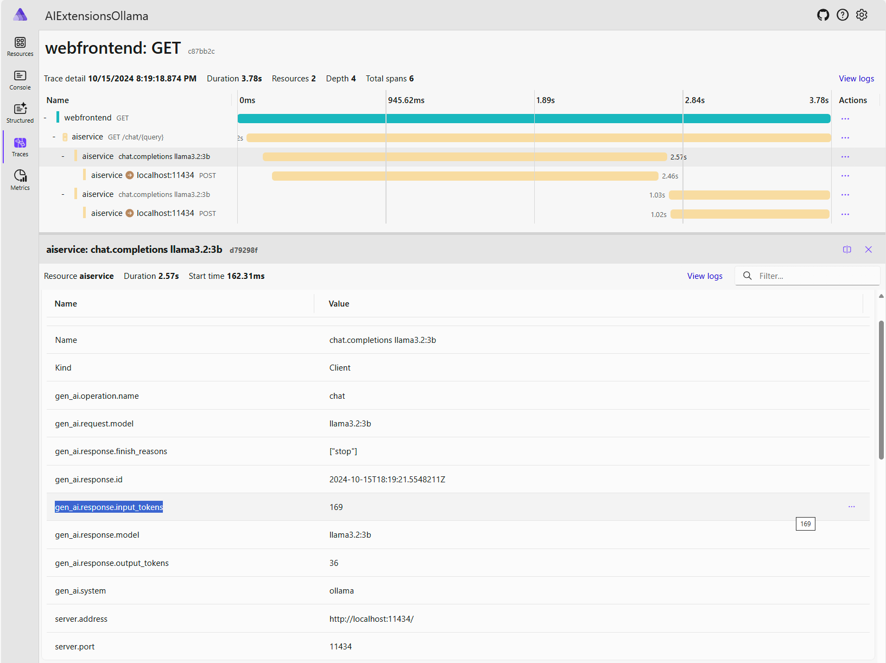

# AIExtensionsOllama

This is a web project to be able to test

* [.NET Aspire 9](https://learn.microsoft.com/en-us/dotnet/aspire/get-started/aspire-overview)
* [Microsoft.Extensions.AI](https://devblogs.microsoft.com/dotnet/introducing-microsoft-extensions-ai-preview/)
* [Ollama](https://www.ollama.com/)
* [Tool calling](https://www.ollama.com/blog/tool-support)
* [OpenTelemetry](https://learn.microsoft.com/en-us/dotnet/core/diagnostics/observability-with-otel)
* [Fluent UI Blazor](https://github.com/microsoft/fluentui-blazor)

**.NET Aspire 9 will support .NET 8 and .NET 9** 👍🏼

Also, **replace the need of a .NET workload which is replaced by a .NET SDK** 🎉

## Microsoft.Extensions.AI using OpenTelemetry on .NET Aspire 9 dashboard

Showing the call to Ollama and data like number of tokens

