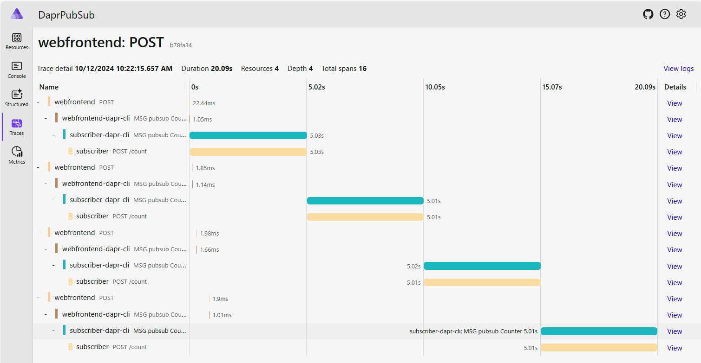

# Dapr Pub/Sub

Sample application demonstrating the usage of Dapr Pub/Sub with Redis Stream.

The configuration of [Redis Streams](https://docs.dapr.io/reference/components-reference/supported-pubsub/setup-redis-pubsub/)
is done in [DaprPubSub.AppHost/components](https://github.com/laurentkempe/aspirePlayground/blob/main/DaprPubSub/DaprPubSub.AppHost/components/pubsub.yaml)
and set its metadata "concurrency" to "1", so that the number of concurrent workers that are processing messages is one.
It means that our DaprPubSub.Subscriber will get one message at a time, and mimic the behavior of a pull based Pub/Sub.

You can see its behavior on the .NET Aspire dashboard trace:

