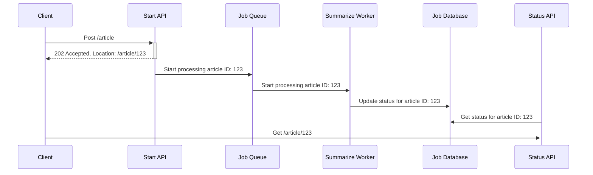

# LocalLLMSummarize

The goal of this project is to have a simple web application which get a saved article from [omnivore.app](https://omnivore.app/).
The application then summarize the articles using a local LLM and display the summary to the user.

The application is implemented using the following technologies:
- [.NET Aspire](https://learn.microsoft.com/en-us/dotnet/aspire/get-started/aspire-overview) for building the distributed application
- [Dapr](https://dapr.io/) for building the workflow
- [Fluent UI Blazor](https://www.fluentui-blazor.net/) for the UI
- [Ollama](https://ollama.com/) to run LLM locally
- [MistralAI](https://mistral.ai/) for the LLM model
- [Omnivore](https://omnivore.app/) and its API to get saved articles

## Configuration

You need to configure your omnivore key `omnivoreAuthToken` on the project `LocalLLMSummarize.Web` on the file `appsettings.Development.json`
to be able to retrieve your articles.

You need to have Ollama running on your local machine, download Ollama [here](https://ollama.com/download).

Finally, you can define which LLM you want to use, selecting one from [Ollama library](https://ollama.com/library) and updating
the code on the project `LocalLLMSummarize.SummarizeService` on the file `Program.cs`, per default it uses mistral
`kernelBuilder.AddOllamaTextGeneration(modelId: "mistral", "http://localhost:11434")`.

## Implementation architecture

The application Use Dapr workflow to implement an [asynchronous request-reply pattern](https://docs.dapr.io/developing-applications/building-blocks/workflow/workflow-patterns/#async-http-apis).

We create a Dapr ArticleSummarizingWorkflow accepting a omnivore article slug. The workflow is composed of the following activities:
1. Get the content of the article from omnivore
2. Summarize the article using local LLM
3. Save the summary in the database

